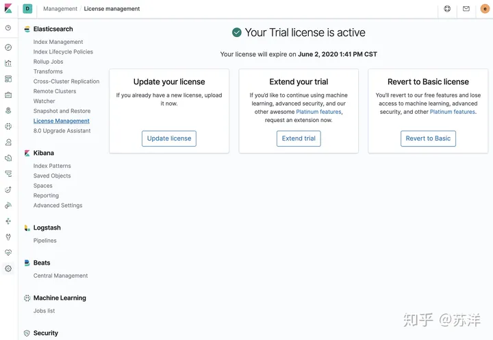
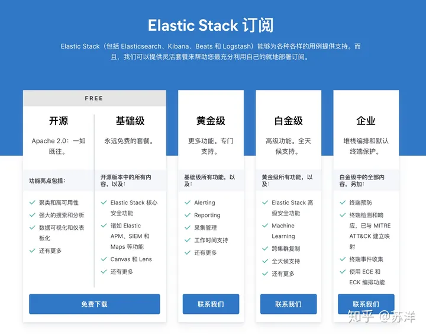
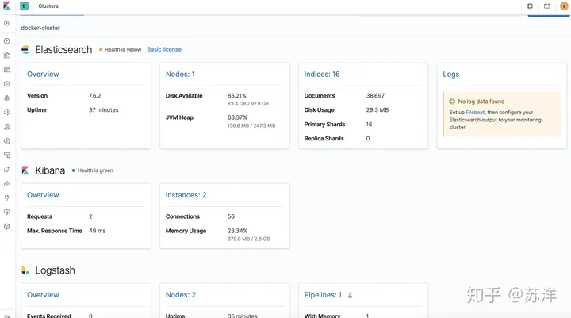
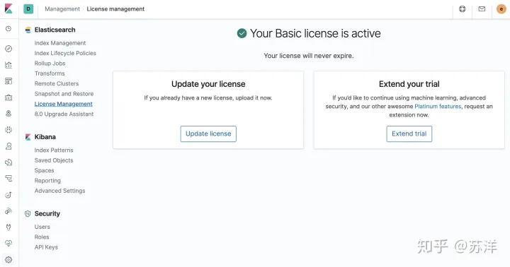

原文链接：https://zhuanlan.zhihu.com/p/138128187

docker-elk 项目地址：https://github.com/deviantony/docker-elk.git


目录结构：

```
├── docker-compose.yml
├── docker-stack.yml
├── elasticsearch
│   ├── config
│   │   └── elasticsearch.yml
│   └── Dockerfile
├── extensions
│   ├── apm-server
│   ├── app-search
│   ├── curator
│   ├── logspout
├── kibana
│   ├── config
│   │   └── kibana.yml
│   └── Dockerfile
├── LICENSE
├── logstash
│   ├── config
│   │   └── logstash.yml
│   ├── Dockerfile
│   └── pipeline
│       └── logstash.conf
└── README.md
```

项目主要使用根目录的 **docker-compose.yml** 作为启动配置，并在首次启动时，构建相关服务的容器镜像。


使用浏览器或者 curl 等工具访问机器地址加端口号 9200，并使用默认用户名 `elastic` 和默认密码 `changeme` 来访问 Elasticsearch HTTP 端口。


### 重置内建用户密码

使用 `docker-compose exec -T elasticsearch bin/elasticsearch-setup-passwords auto --batch` 命令对服务默认的账户进行默认密码重置。


```
docker-compose exec -T elasticsearch bin/elasticsearch-setup-passwords auto --batch

Changed password for user apm_system
PASSWORD apm_system = YkELBJGOT6AxqsPqsi7I

Changed password for user kibana
PASSWORD kibana = FxRwjm5KRYvHhGEnYTM9

Changed password for user logstash_system
PASSWORD logstash_system = A4f5VOfjVWSdi0KAZWGu

Changed password for user beats_system
PASSWORD beats_system = QnW8xxhnn7LMlA7vuI7B

Changed password for user remote_monitoring_user
PASSWORD remote_monitoring_user = OvjEGR13wjkOkIbWqaEM

Changed password for user elastic
PASSWORD elastic = PGevNMuv7PhVnaYg7vJw
```


将密码妥善保存后，我们需要将 `docker-compose.yml` 配置文件中的 elasticsearch 服务的 `ELASTIC_PASSWORD` 去掉，这样可以确保服务启动只使用我们刚刚重置后的密码（keystore）。以及需要对 kibana 、 logstash 配置文件中的信息进行替换，将文件中的 **elastic** 用户的密码进行更新，相关文件我们在开篇的目录结构中有提过，暂时先修改下面三个文件就可以了：

- kibana/config/kibana.yml
- logstash/config/logstash.yml
- logstash/pipeline/logstash.conf

需要注意的是， logstash pipeline 需要一个高权限账号，当前测试开发过程中，可以使用上面重置后的 elastic 账号和密码，如果是生产使用可以参考官方文档 [Configuring Security in Logstash](https://link.zhihu.com/?target=https%3A//www.elastic.co/guide/en/logstash/current/ls-security.html) 进行操作，分配一个新的专用账号。

在配置修改完毕后，我们执行 `docker-compose restart` 重启相关服务。


### 关闭付费组件

打开设置界面，选择 Elasticsearch 模块中的 License Management ，可以看到默认软件会启动为期一个月的高级功能试用。





在 [官方订阅](https://link.zhihu.com/?target=https%3A//www.elastic.co/cn/subscriptions) 页面，我们可以看到官方支持的订阅类型，一般来说，如果没有特殊需求，使用基础版本就好。





如果你想要了解软件当前运行状态，除了登陆机器，查看宿主机和容器状态外，在监控界面，我们也可以方便快捷的看到单节点中各个服务的运行状态和资源占用。





选择“Revert to Basic license”，选择回退到基础版本，可以看到整个界面都简洁了不少，至此如果不付费的话，就可以安心合法的使用软件了。





当然，你也可以在 elasticsearch.yml 配置文件中的 `xpack.license.self_generated.type` 修改为 `basic` 来禁用 X-Pack 相关功能。


## 修改自官方示例的生产环境

生产环境的基础要求是高可用性，常规实现方案中见的比较多的是“多副本/实例”，多机器，多机架，甚至多区域部署。

本文我们先聊聊最简单的多实例。

### 前置准备

如果想让生产环境中使用 Docker 运行 ELK，有一些必备的系统设置必不可少。

首先调整 `vm.max_map_count` 的数值，至少调整到 262144 以上。在 `/etc/sysctl.conf` 添加下面的内容即可。

```text
vm.max_map_count = 262144

sysctl -w vm.max_map_count=262144
```

然后调整 `ulimits` 以及 `nprocedit`，因为我们使用容器运行 ELK 相关应用，所以直接修改 compose 配置文件中的 ES 配置就可以了：

```text
ulimits:
  memlock:
    soft: -1
    hard: -1
```

我们继续调整，关闭内存交换，同样修改 compose 配置文件中的 ES 配置即可：

```text
environment:
  bootstrap.memory_lock: "true"
```

Java 堆大小同样需要调整，默认的数值如下，在生产环境中太小了，更详细的内容可以参考[这里](https://link.zhihu.com/?target=https%3A//www.elastic.co/guide/en/elasticsearch/reference/current/heap-size.html)。

```text
environment:
  ES_JAVA_OPTS: "-Xmx1g -Xms1g"
```

如果你真实使用在生产环节，务必开启 TLS 和密码认证，此处为了不额外扩展篇幅（以及懒得申请通配符证书/配置自签名）先使用关闭安全配置的方式忽略这个设置 : )

### 修改配置支持多实例

官方多实例方案（[这篇官方指引](https://link.zhihu.com/?target=https%3A//www.elastic.co/guide/en/elasticsearch/reference/current/docker.html)），采取在 compose 中定义三个不同的服务，然后使用第一个服务作为 Master 对外暴露服务，我们先以该方案为基础，并进行一些调整。

首先创建服务所需要的数据目录，并赋予所需要的权限。

```text
mkdir -p data/{es01,es02,es03}
chmod g+rwx data/*
chgrp 0 data/*
```

之前在单节点中，我们挂载的数据使用的是容器的数据卷方案，在这里，我们可以考虑使用性能更好的文件映射替换之前的方案，当然也可以配合[储存插件](https://link.zhihu.com/?target=https%3A//docs.docker.com/engine/extend/legacy_plugins/)使用：

```text
volumes:
  - ./elasticsearch/config/elasticsearch.yml:/usr/share/elasticsearch/config/elasticsearch.yml:ro
  - ./data:/usr/share/elasticsearch/data:rw
```

考虑到多实例之间配置几乎一致，并且如果要单独维护太过啰嗦，我们可以将 `elasticsearch.yml` 内的配置使用环境变量的方式写在 compose 配置文件中：

```text
environment:
  cluster.name: "docker-cluster"
  network.host: "0.0.0.0"
  bootstrap.memory_lock: "true"
  xpack.license.self_generated.type: "basic"
  xpack.security.enabled: "false"
  xpack.monitoring.collection.enabled: "true"
  ES_JAVA_OPTS: "-Xmx1g -Xms1g"
```

此外，因为涉及到多个节点组网，所以这里需要额外指定这些实例的节点名称等信息：

```text
version: "3.2"

services:
  elasticsearch01:
    environment:
      node.name: "es01"
      discovery.seed_hosts: "es02,es03"
      cluster.initial_master_nodes: "es01,es02,es03"

  elasticsearch02:
    environment:
      node.name: "es02"
      discovery.seed_hosts: "es01,es03"
      cluster.initial_master_nodes: "es01,es02,es03"

  elasticsearch03:
    environment:
      node.name: "es03"
      discovery.seed_hosts: "es01,es02"
      cluster.initial_master_nodes: "es01,es02,es03"
```

最后，按照官网的推荐的模式，让其中一台机器支持对外暴露端口，与外部进行数据交换即可。

```text
ports:
  - 9200:9200
  - 9300:9300
```

到这里多实例就配置完成了。

### 更新 Logstash 配置

logstash 需要更新的有两处，一处是要让服务在 刚刚定义的 elasticsearch 实例启动之后再启动，另外可以将配置以相同方式改写，方便后续维护。

```text
logstash:
  volumes:
    - ./logstash/config/logstash.yml:/usr/share/logstash/config/logstash.yml:ro
    - ./logstash/pipeline:/usr/share/logstash/pipeline:ro
  depends_on:
    - elasticsearch01
    - elasticsearch02
    - elasticsearch03
```

接着需要更新 `logstash/config/logstash.yml` 配置中的 `xpack.monitoring.elasticsearch.host` 信息，确保启动不会出现问题。

```text
xpack.monitoring.elasticsearch.hosts: [ "http://es01:9200" ]
```

以及 `logstash/pipeline/logstash.conf` 配置中的 `output. elasticsearch` 信息为 `hosts => "es01:9200"`。

### 更新 Kibana 配置

需要更新的地方有三处，两处同 Logstash ，额外还有一处是指定 `ELASTICSEARCH_URL` 地址为我们暴露服务的 elasticsearch 实例的地址。

```text
kibana:
  volumes:
    - ./kibana/config/kibana.yml:/usr/share/kibana/config/kibana.yml:ro
  ports:
    - "5601:5601"
  depends_on:
    - elasticsearch01
    - elasticsearch02
    - elasticsearch03
  environment:
    - ELASTICSEARCH_URL=http://es01:9200
    - xpack.security.enabled=false
```

以及需要额外更新 `kibana/config/kibana.yml` 配置中的 `elasticsearch.hosts` 字段信息：

```text
elasticsearch.hosts: [ "http://es01:9200" ]
```

### 完整配置文件

上述配置完成内容如下：

```text
version: "3.2"

services:
  elasticsearch01:
    image: docker.elastic.co/elasticsearch/elasticsearch:7.6.2
    container_name: es01
    volumes:
      - ./data/es01:/usr/share/elasticsearch/data:rw
    ports:
      - 9200:9200
      - 9300:9300
    environment:
      node.name: "es01"
      cluster.name: "docker-cluster"
      network.host: "0.0.0.0"
      discovery.seed_hosts: "es02,es03"
      cluster.initial_master_nodes: "es01,es02,es03"
      bootstrap.memory_lock: "true"
      xpack.license.self_generated.type: "basic"
      xpack.security.enabled: "false"
      xpack.monitoring.collection.enabled: "true"
      ES_JAVA_OPTS: "-Xmx1g -Xms1g"
    ulimits:
      memlock:
        soft: -1
        hard: -1
    networks:
      - elk

  elasticsearch02:
    image: docker.elastic.co/elasticsearch/elasticsearch:7.6.2
    container_name: es02
    volumes:
      - ./data/es02:/usr/share/elasticsearch/data:rw
    environment:
      node.name: "es02"
      cluster.name: "docker-cluster"
      network.host: "0.0.0.0"
      discovery.seed_hosts: "es01,es03"
      cluster.initial_master_nodes: "es01,es02,es03"
      bootstrap.memory_lock: "true"
      xpack.license.self_generated.type: "basic"
      xpack.security.enabled: "false"
      xpack.monitoring.collection.enabled: "true"
      ES_JAVA_OPTS: "-Xmx1g -Xms1g"
    ulimits:
      memlock:
        soft: -1
        hard: -1
    networks:
      - elk

  elasticsearch03:
    image: docker.elastic.co/elasticsearch/elasticsearch:7.6.2
    container_name: es03
    volumes:
      - ./data/es03:/usr/share/elasticsearch/data:rw
    environment:
      node.name: "es03"
      cluster.name: "docker-cluster"
      network.host: "0.0.0.0"
      discovery.seed_hosts: "es01,es02"
      cluster.initial_master_nodes: "es01,es02,es03"
      bootstrap.memory_lock: "true"
      xpack.license.self_generated.type: "basic"
      xpack.security.enabled: "false"
      xpack.monitoring.collection.enabled: "true"
      ES_JAVA_OPTS: "-Xmx1g -Xms1g"
    ulimits:
      memlock:
        soft: -1
        hard: -1
    networks:
      - elk

  logstash:
    build:
      context: logstash/
      args:
        ELK_VERSION: $ELK_VERSION
    volumes:
      - ./logstash/config/logstash.yml:/usr/share/logstash/config/logstash.yml:ro
      - ./logstash/pipeline:/usr/share/logstash/pipeline:ro
    ports:
      - "5000:5000/tcp"
      - "5000:5000/udp"
      - "9600:9600"
    environment:
      LS_JAVA_OPTS: "-Xmx1g -Xms1g"
    networks:
      - elk
    depends_on:
      - elasticsearch01
      - elasticsearch02
      - elasticsearch03

  kibana:
    build:
      context: kibana/
      args:
        ELK_VERSION: $ELK_VERSION
    volumes:
      - ./kibana/config/kibana.yml:/usr/share/kibana/config/kibana.yml:ro
    ports:
      - "5601:5601"
    networks:
      - elk
    depends_on:
      - elasticsearch01
      - elasticsearch02
      - elasticsearch03
    environment:
      - ELASTICSEARCH_URL=http://es01:9200
      - xpack.security.enabled=false

networks:
  elk:
    driver: bridge
```

其实如果你全部使用官方镜像，而不做二次定制，比如安装插件的话，那么都改为官方镜像名称即可。

启动服务之后，打开 kibana 可以看到多实例的 ELK 环境就配置完毕了。