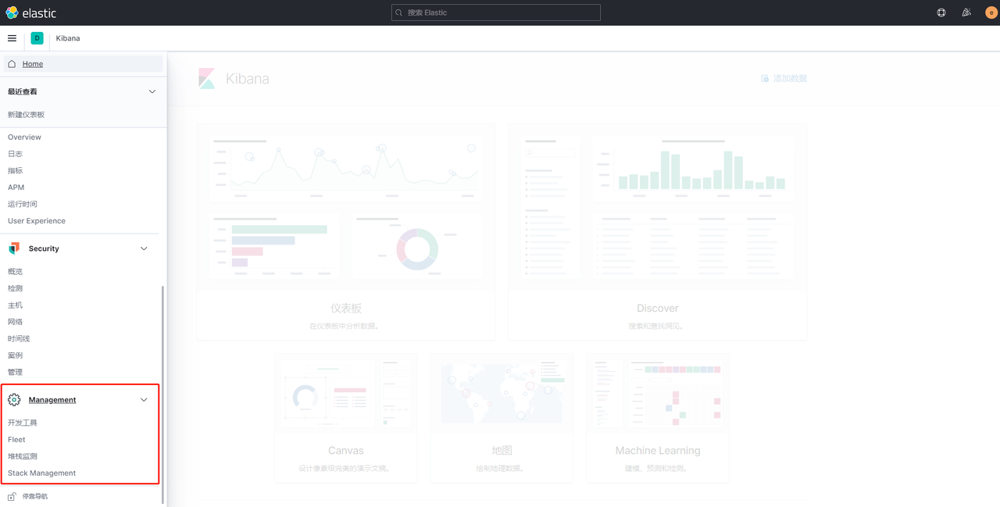
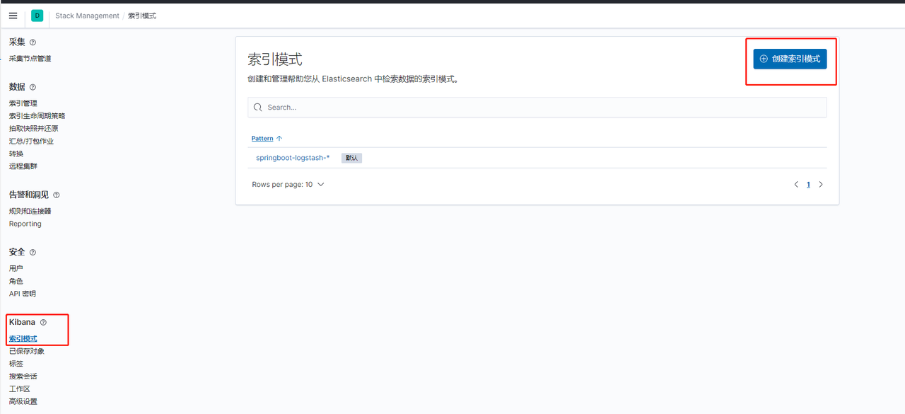

当前案例中使用 7.13.0 版本

其中 filebeat 下载页面 https://www.elastic.co/cn/downloads/past-releases/filebeat-7-13-0


# 启动elk

在.env文件里指定elk的基本挂载目录


linux 下启动 elasticsearch 需要将线程的任务数改大一点（没记错的话应该是这个原因）

```shell
# 改变设置 
sysctl -w vm.max_map_count=262144 
# 使之立即生效 
sysctl -p

# es的数据挂载目录需要全权限
chomd 777 /你的挂载根目录/elk/elasticsearch/data
```


### **修改logstash.conf输出到es**

```conf
input {
  tcp {
    mode => "server"
    host => "0.0.0.0"
    port => 4560
    codec => json_lines
  }
}
output {
  elasticsearch {
    hosts => "es:9200"
    index => "springboot-logstash-%{+YYYY.MM.dd}"
    user => "elastic"
    #password => "没密码就没密码"
  }
}
```


## 启动容器

```shell
#可以使用-f 参数指定compose文件，不指定也行
docker-compose -f docker-compose.yml up -d
```


```shell
# 进入logstash容器 
docker exec -it elk-logstash-server /bin/bash
# 进入bin目录
cd /bin
# 安装插件
logstash-plugin install logstash-codec-json_lines 
# 退出容器
exit
# 重启logstash服务
docker restart elk-logstash-server
```


### kibana设置中文

kibana容器内配置文件地址 /usr/share/kibana/config/kibana.yml

```shell
#进入kibana容器
docker exec -it elk-kibana-server /bin/bash
#进入配置文件目录
cd config/
#查看配置文件
vi kibana.yml
#在该文件最后一行加一行
i18n.locale: "zh-CN"
#(G 到最后一行，按i 进入插入模式，输入后 exc 退出插入模式，:wq 保存退出文件 ；其他 vi 命令见下)
#退出容器
exit
#重启服务
docker restart elk-kibana-server
```

若在Insert模式下，需要先按一下Esc，

- 文首：按`gg`（区分大小写）
- 文末：按`G`（区分大小写）

（跳转到行首和行尾，各有两种方法：）

- 行首：①按`Home`
  　　　②按`0`（数字0）
- 行尾：①按`End` 　
  　　　②按`$`（Shift + 4）


### **使用Kibana在es创建Index索引**

浏览器访问 http://localhost:5601 进入kibana.




创建logstack输出到es的索引模式（使用filebeat 后面配）




### 安装 filebeat

以windows下为例：

配置文件为 filebeat.yml

```yml
#配置 enabled: true 这个配置很重要，只有配置为true之后配置才可生效，否则不起作用
- type: log

  # Change to true to enable this input configuration.
  enabled: true

  # Paths that should be crawled and fetched. Glob based paths.
  paths:
    - 你的日志所在目录\*.log
    #- c:\programdata\elasticsearch\logs\*
    
#配置Outputs ，这里的Outputs有elasticsearch，logstash。按照配置文件下面的示例配置即可。只能配置一个输出。默认是ElasticSearch
output.logstash:
  # The Logstash hosts
  hosts: ["localhost:4560"]
```


直接运行 filebeat.exe

可以通过 -c filebeat.yml 参数指定配置文件位置，也可以不指定

-e 参数开启控制台日志输出（默认控制台不输出）


现在可以在kibana的索引管理里面看到日志了

---

# 修改es密码

#### **为ELK增加权限控制**


```bash
### es增加密码
docker exec -it elk-elasticsearch-server /bin/bash
vi config/elasticsearch.yml
```


#### es容器内配置文件

```bash
cluster.name: "docker-cluster"
network.host: 0.0.0.0
xpack.security.enabled: true
xpack.license.self_generated.type: basic
xpack.security.transport.ssl.enabled: true
```


```bash
### 重启es,初始化密码
docker restart elk-elasticsearch-server
docker exec -it elk-elasticsearch-server /bin/bash
elasticsearch-setup-passwords interactive
```


#### **修改logstash.conf增加访问es的账号密码**

```conf
input {
  tcp {
    mode => "server"
    host => "0.0.0.0"
    port => 4560
    codec => json_lines
  }
}
output {
  elasticsearch {
    hosts => "es:9200"
    index => "springboot-logstash-%{+YYYY.MM.dd}"
    user => "elastic"
    password => "密码我不告诉你"
  }
}
```


#### **修改Kibana增加访问es的账号密码**

```bash
# Default Kibana configuration for docker target
server.host: "0"
elasticsearch.hosts: [ "http://elasticsearch:9200" ]
monitoring.ui.container.elasticsearch.enabled: true
i18n.locale: "zh-CN"
elasticsearch.username: "elastic"
elasticsearch.password: "你的密码"
```

